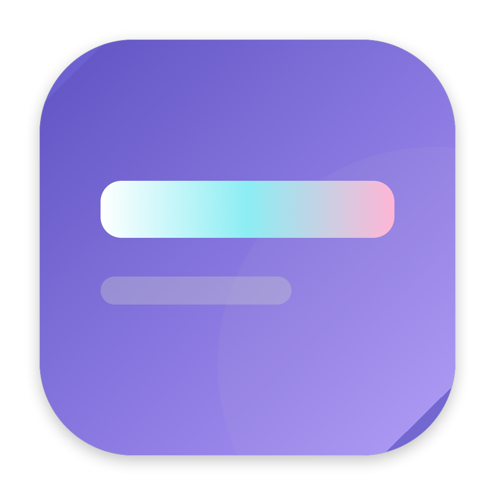
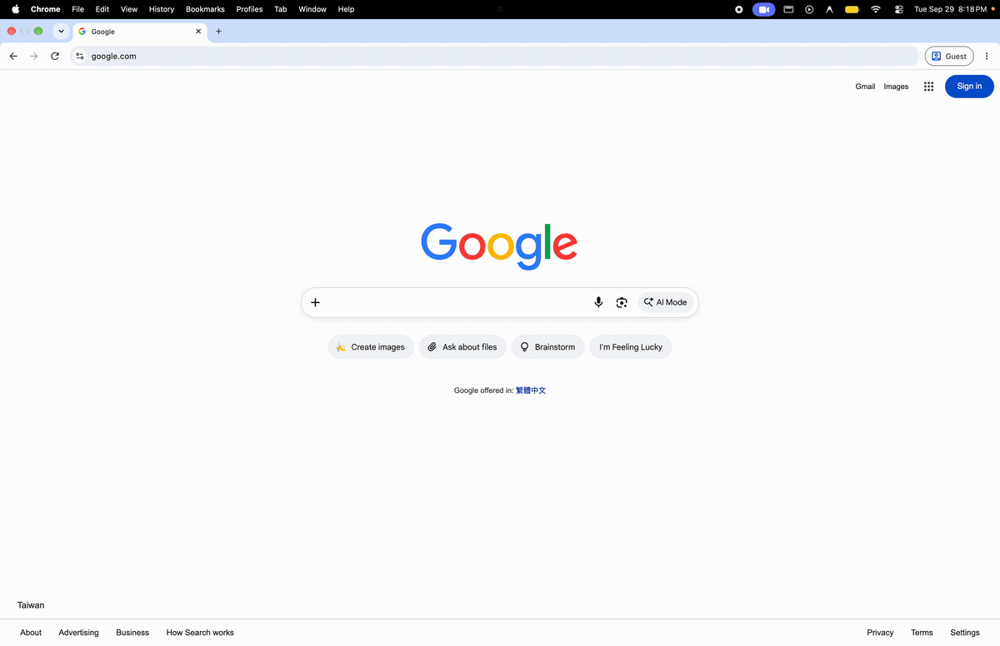
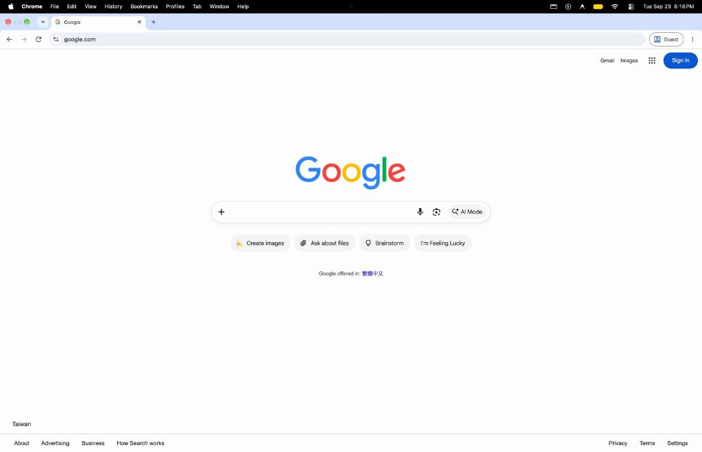
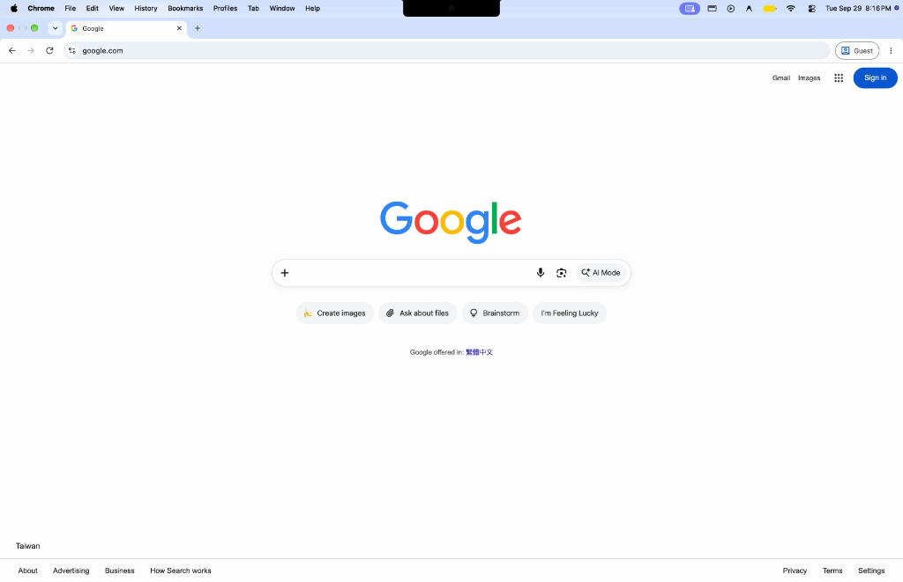
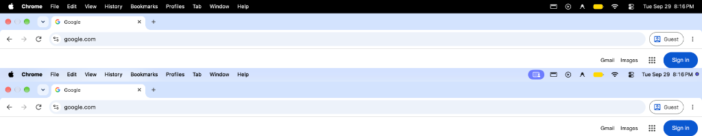
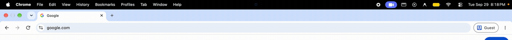
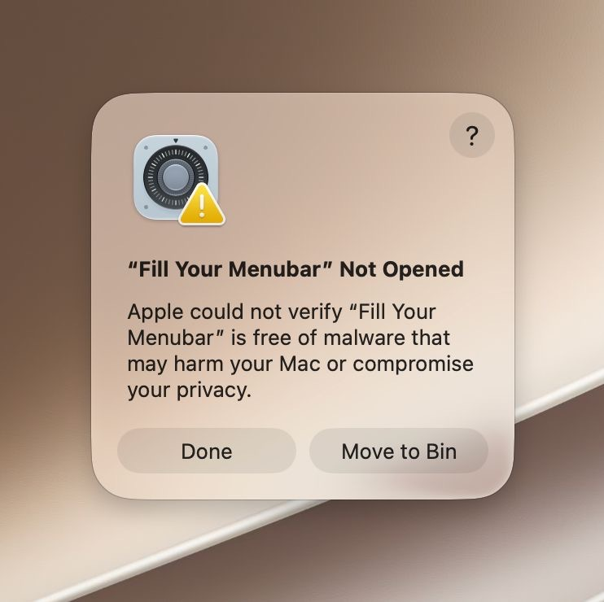
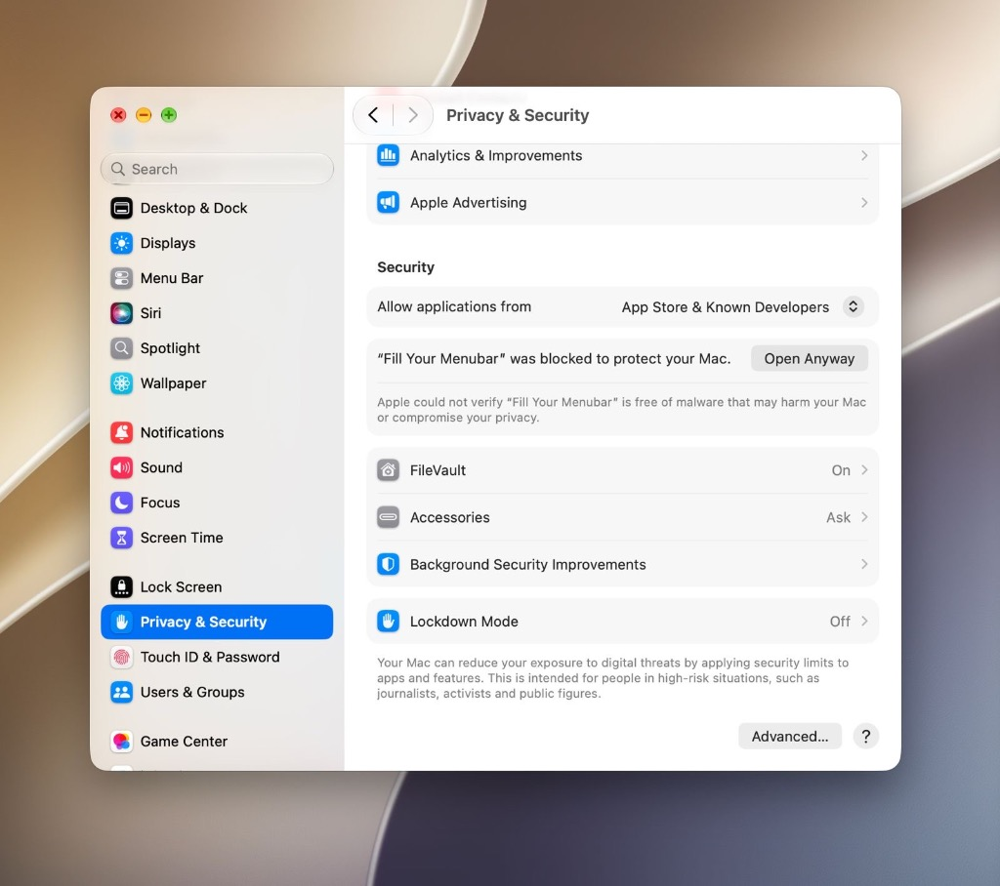
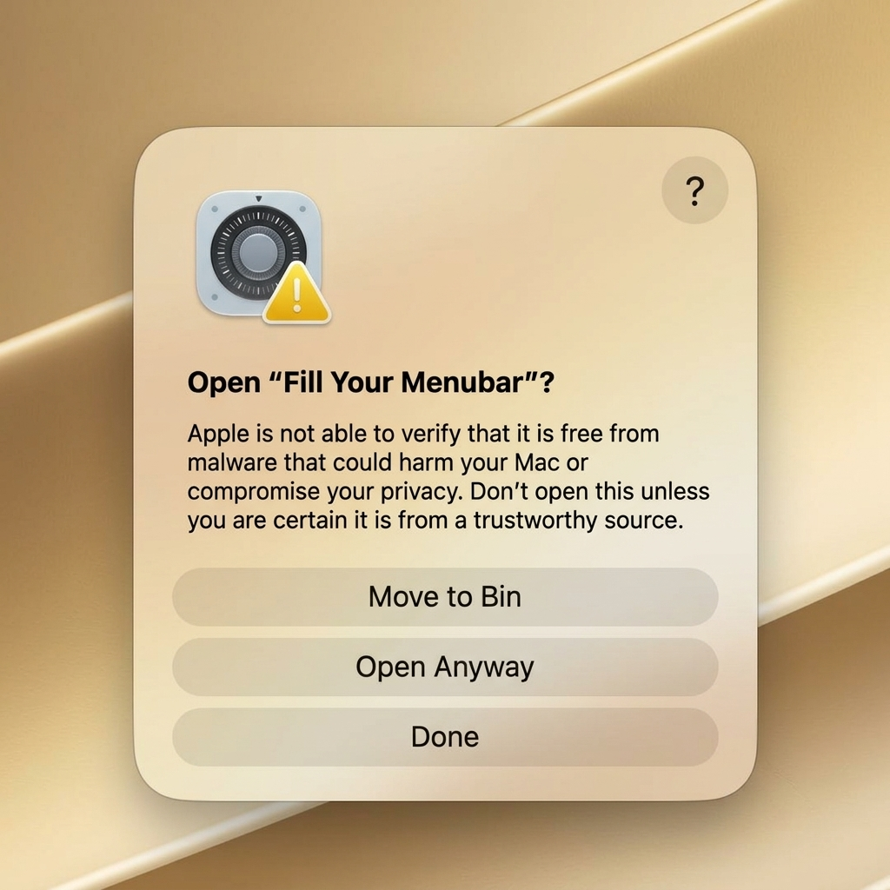

<div align="center">
  
  <h1>Fill Your Menubar</h1>
  <p><strong>Bring your menubar back alive. Intelligent, adaptive wallpaper auto-color for macOS.</strong></p>

  <p>
    <a href="https://github.com/jedieason/fill-your-menubar/releases/latest"></a>
    <a href="LICENSE"></a>
    
    
    <a href="https://github.com/jedieason/fill-your-menubar/issues"></a>
  </p>

  <table>
    <tr>
      <th><a href="https://github.com/jedieason/fill-your-menubar/releases/latest">Download DMG ↗</a></th>
      <td><a href="#-auto-color-in-action">Auto Color</a></td>
      <td><a href="#-features">Features</a></td>
      <td><a href="#-installation">Installation</a></td>
      <td><a href="#-pricing--patent-protection">License & Patent</a></td>
      <td><a href="https://github.com/jedieason/fill-your-menubar/issues">Help & Feedback</a></td>
    </tr>
  </table>
</div>

<br />

<p align="center">
  
</p>
<p align="center">
  <em>✨ Watch the smooth 0.32s adaptive color fill animation activate as an app enters fullscreen.</em><br />
  <small><a href="assets/demo-animation.mp4">▶ High-Definition 60fps Video (MP4)</a> &bull; <a href="assets/demo-animation.mov">Original QuickTime (.mov)</a></small>
</p>

---

## ✨ Overview

Apple's stock macOS menu bar has remained static, disconnected, and visually uninspiring. In fullscreen applications, macOS presents an abrupt pitch-black bar that cuts off the content below.

**Fill Your Menubar** transforms the top edge of your Mac into an organic, harmonious extension of your desktop and active windows. Powered by proprietary, real-time edge sampling and WindowServer-level compositing, it continuously extracts the exact color mood of your active applications—bringing your display to life with zero latency, zero screen flicker, and flawless native readability.

> **100% Free to Use:** Fill Your Menubar is a proprietary freeware utility protected by patents. It is completely free to download and use for everyone.

---

## 🎨 Auto Color in Action

### Real macOS Screenshot Evidence

Here is how **Fill Your Menubar Auto Color** actually performs on macOS:

<table>
  <tr>
    <th width="50%" align="center">❌ Stock macOS (Before)</th>
    <th width="50%" align="center">✅ Fill Your Menubar (After)</th>
  </tr>
  <tr>
    <td>
      
    </td>
    <td>
      
    </td>
  </tr>
  <tr>
    <td align="center"><em>Abrupt pitch-black menu bar cuts off the browser.</em></td>
    <td align="center"><em>Fluid adaptive color fill seamlessly matches the active window with status pills.</em></td>
  </tr>
</table>

<br />

<p align="center">
  
</p>
<p align="center">
  <em>Top: Stock macOS default fullscreen bar &bull; Bottom: Fill Your Menubar with adaptive gradient fill and pill-accented status items.</em>
</p>

### Why Auto Color is Superior

| Feature | Stock macOS Menu Bar | Fill Your Menubar (Auto Color) |
| :--- | :--- | :--- |
| **Visual Integration** | Flat, disconnected black or generic blur | **Dynamically sampled directly from active window** |
| **Multi-Zone Adaptation** | Uniform single tone | **Dual-band regional sampling** matching split windows |
| **Native Text Clarity** | Fixed system opacity | **Patented WindowServer compositing** with auto-contrast |
| **Screen Transitions** | Abrupt cuts | **Fluid 60fps sampling** with customizable Gaussian smoothing |
| **Geometry** | Rigid edge-to-edge bar only | **Full Width Bar** or modern **Floating Pills** |

<br />

<p align="center">
  
</p>
<p align="center">
  <em>Close-up: Real-time WindowServer compositing smoothly tinting the top bar with native readability.</em>
</p>

---

## 🚀 Key Features

### 🌈 1. Intelligent Wallpaper Auto Color
- **Real-Time Edge Sampling:** Continuously samples the display strip immediately below the menu bar, creating a seamless visual continuation from wallpaper to menu bar.
- **Dual-Band Regional Hues:** If your desktop is split between a dark terminal on the left and a colorful browser on the right, Auto Color samples both sides independently.
- **Configurable Smoothing & Opacity:** Fine-tune Gaussian color blur and opacity (from subtle atmospheric tint to bold solid accent) to match your aesthetic taste.

### 🛡️ 2. Patented Native Compositing
- **Zero-Flicker Presentation:** Engineered with proprietary WindowServer-level layering (`CGWindowLevelForKey`) and ScreenCaptureKit exclusion filtering.
- **100% Native Readability:** The Apple menu (), active application menus (*Finder*, *File*, *Edit*...), status icons (WiFi, Battery, Control Center), and Clock remain 100% interactive and razor-sharp.
- **Automatic Contrast Switching:** Menus dynamically adapt between crisp dark and pure white typography depending on the sampled backdrop luminance.

### 💊 3. Flexible Shapes & Modern Styling
- **Full Width Bar:** Continuous edge-to-edge color coverage spanning the entire width of any display.
- **Floating Pills Dock:** Splits the bar into elegant floating capsules hugging your application menus on the left and system status items on the right.
- **Display Corner Rounding:** Optional top and bottom screen corner masks with configurable radius to soften your display borders.
- **Pointer Light Reflection:** An interactive subtle light beam that smoothly tracks your cursor near the bar with realistic distance falloff.

### ⚡ 4. Privacy & Performance First
- **100% Local & On-Device:** Zero telemetry, zero analytics, zero external network connections. All sampling occurs strictly in memory and is discarded immediately.
- **Battery-Conscious:** Automatically suspends sampling during display sleep, fullscreen video playback, or when the cursor hovers over menus.
- **Multi-Monitor Native:** Automatically recognizes multiple displays and samples each monitor's desktop space independently.

---

## 📥 Installation

### Download & Install (DMG)

1. Download the latest universal disk image: **[Fill-Your-Menubar-2.0.10-universal.dmg](https://github.com/jedieason/fill-your-menubar/releases/latest)**.
2. Double-click the DMG and drag **Fill Your Menubar** into your **Applications** folder.
3. Launch **Fill Your Menubar** from Applications or Spotlight.
4. Click the menu bar icon to open **Settings**, and toggle **Enable Fill Your Menubar**. Set Color Source to **Sampled (Auto Color)**.

---

### 🍏 Step-by-Step Guide: Opening on macOS (First Launch)

Because Fill Your Menubar is distributed directly outside the Mac App Store as an ad-hoc signed utility, macOS Gatekeeper may show a security notice on the very first launch. Follow these 3 simple steps to open it:

#### **Step 1: Click "Done" on the initial warning**
When you first open the app, macOS will display the notice:  
> *"“Fill Your Menubar” Not Opened — Apple could not verify “Fill Your Menubar” is free of malware that may harm your Mac or compromise your privacy."*  

👉 Click **Done** (do **not** click *Move to Bin*).

<p align="center">
  
</p>

#### **Step 2: Allow the app in System Settings**
1. Open **System Settings** on your Mac.
2. Click **Privacy & Security** in the sidebar.
3. Scroll down to the **Security** section. You will see:  
   > *“Fill Your Menubar” was blocked to protect your Mac.*  
4. Click the **Open Anyway** button.

<p align="center">
   Privacy & Security and click Open Anyway" width="620">
</p>

#### **Step 3: Confirm by clicking "Open Anyway"**
A final confirmation dialog will appear:  
> *"Open “Fill Your Menubar”? Apple is not able to verify that it is free from malware..."*  

👉 Click **Open Anyway** (enter your Mac password or Touch ID if prompted).

<p align="center">
  
</p>

🎉 **You're all set!** Fill Your Menubar is now fully trusted and will launch smoothly without any further prompts.

---

## 🔒 Permissions Explained

Fill Your Menubar requires two standard macOS permissions to deliver its adaptive features:
- **Screen Recording:** Required by Apple's ScreenCaptureKit solely to sample the wallpaper colors directly underneath the menu bar. Frames are processed strictly in volatile memory and never recorded, saved, or transmitted.
- **Accessibility:** Used exclusively to measure menu item widths for precise Floating Pill alignment and window snapping. It never monitors keystrokes or user input.

---

## 💻 macOS Compatibility

- **macOS 26+**: Fully optimized with native ScreenCaptureKit display filtering.
- **macOS 11 (Big Sur) through macOS 15 (Sequoia)**: Backwards-compatible fallback layering.
- **Hardware:** Universal Binary running 100% native on **Apple Silicon** (M1 / M2 / M3 / M4) and **Intel** Macs.

---

## 📜 Pricing & Patent Protection

### Why is Fill Your Menubar on GitHub if it's Closed Source?
Many beloved macOS utilities (such as *Mac Mouse Fix*, *Raycast*, and *Shottr*) maintain their official distribution, documentation, release binaries, and user community hubs on GitHub. 

- **100% Free to Use:** Fill Your Menubar is free for personal, educational, and commercial desktop use.
- **Proprietary & Patented:** Fill Your Menubar is **NOT open source** and is not licensed under the MIT License or GPL. The underlying menu bar compositing architecture, WindowServer-level layering safeguards, and dynamic color sampling methods are protected by copyright and patent laws (patents and patent applications pending).
- **No Source Code Distribution:** The compiled binary application is provided for free download. Reverse engineering, decompiling, extracting source code, or distributing modified forks is strictly prohibited. See [`LICENSE`](LICENSE) for complete terms.

---

## ❓ Frequently Asked Questions

<details>
<summary><strong>Does Auto Color drain my MacBook's battery?</strong></summary>
<p>No. Fill Your Menubar uses hardware-accelerated ScreenCaptureKit frame deduplication and only inspects a narrow strip below the menu bar. Furthermore, the engine automatically suspends sampling whenever the display sleeps, when fullscreen apps hide the bar, or when you hover over menus.</p>
</details>

<details>
<summary><strong>Can I use Fill Your Menubar on multiple monitors?</strong></summary>
<p>Yes! Fill Your Menubar automatically tracks multiple displays. Each connected monitor samples its own desktop wallpaper independently, allowing dual-monitor setups to have distinct, matching menu bar colors.</p>
</details>

<details>
<summary><strong>Can I customize the color manually if I don't want Auto Color?</strong></summary>
<p>Yes. While Auto Color (Sampled) is the recommended flagship mode, Fill Your Menubar also supports Solid Tints, Vertical Fades, Multi-Stop Custom Palettes, and Rainbow Drift animations via the Settings window.</p>
</details>

<details>
<summary><strong>Does Fill Your Menubar collect any personal data?</strong></summary>
<p>Absolutely not. Fill Your Menubar makes zero network requests. It contains no analytics, no crash reporters, and no advertising trackers. Your screen contents remain completely private on your local machine.</p>
</details>

---

## 🗑️ Uninstallation

To uninstall Fill Your Menubar:
1. Quit **Fill Your Menubar** from the menu bar status icon.
2. Drag **Fill Your Menubar.app** from your `/Applications` folder to the Trash.
3. To optionally clear saved user preferences, open Terminal and run:
   ```bash
   defaults delete local.prismbar.app
   ```

---

## 💬 Feedback & Bug Reports

Have a feature request, translation, or bug to report?
- Open an issue on our **[GitHub Issues](https://github.com/jedieason/fill-your-menubar/issues)** page.
- Check existing discussions before opening new tickets.

---

<div align="center">
  <p>Fill Your Menubar™ is a proprietary product created by <a href="https://github.com/jedieason">Jedieason</a>.</p>
  <p>© 2026 Jedieason. All Rights Reserved. Protected by Patents & Patents Pending.</p>
</div>
